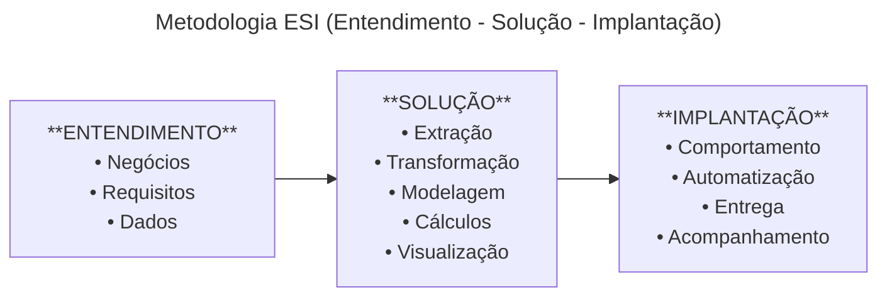
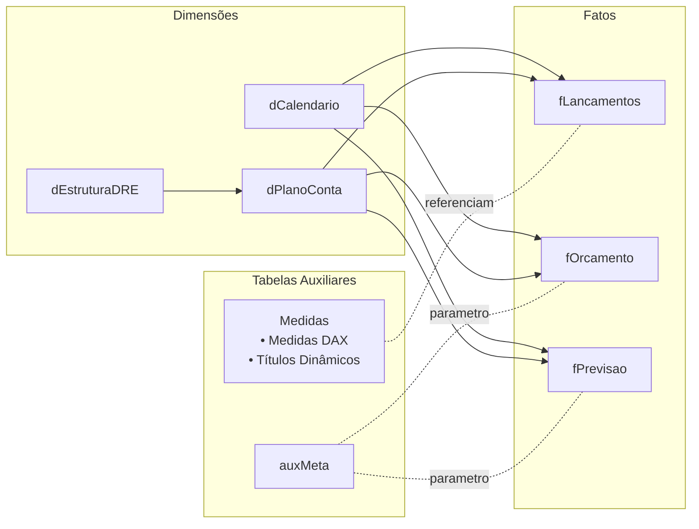

# 📊 **DRE — XPBucks Coffee Shop**

Este projeto trata da criação de um **dashboard completo de Demonstração de Resultados (DRE)** para a XPBucks, com foco em desempenho geral e segmentado por filial acompanhado de uma apresentação executiva para a diretoria apresentando os principais resultados, insights e recomendações.

---

## 🚀 **Acesso Rápido**

<table>
  <tr>
    <td style="width: 1800px; vertical-align: middle;">
      
    </td>
    <td style="padding-left: 20px; vertical-align: middle;">
      <h3>Dashboard — DRE XPBucks</h3>
      

        Dashboard completo de Demonstrativo de Resultado de Exercício (DRE), desenvolvido para monitorar a performance financeira da XPBucks. Inclui segmentação por filial e páginas dedicadas para análises estruturais:
      

      <ul>
        <li>Comparativo Realizado × Meta</li>
        <li>Análise Horizontal</li>
        <li>Acumulado (YTD)</li>
        <li>Análise de Despesas</li>
      </ul>
      

      O objetivo é substituir planilhas antigas por um painel centralizado, de fácil navegação e com métricas críticas consolidadas.
      

      

        <a href="https://app.powerbi.com/view?r=eyJrIjoiOWY3MWMxNGYtNTYyOS00NGZmLTllNmEtZGIxOGI1ODdkNzM5IiwidCI6IjQ3MzViMTc4LTMxNWUtNDhjMC04MTExLTY5YzgxNjkyODllZiJ9">
          📘 Abrir Dashboard
        </a>
      

    </td>
  </tr>
</table>

<table>
  <tr>
    <td style="padding-left: 20px; padding-right: 20px; vertical-align: middle;">
      <h3>Apresentação — DRE XPBucks</h3>
      

        Apresentação executiva construída para comunicar resultados financeiros de forma clara e estratégica para a diretoria. Inclui visão consolidada de desempenho, detalhamento por filial e análise de tendências relevantes:
      

      <ul>
        <li>Visão Geral do Desempenho</li>
        <li>Desempenho por Unidade</li>
        <li>Análises Estruturais e Sazonais</li>
        <li>Indicadores de Performance de Longo Prazo</li>
      </ul>
      

      Elaborada para apoiar decisões operacionais e estratégicas com base em dados consolidados.
      

      

        <a href="https://www.canva.com/design/DAG4gdO1IkU/RUU00U5MoiC5IZNxbiK40g/edit?utm_content=DAG4gdO1IkU&utm_campaign=designshare&utm_medium=link2&utm_source=sharebutton">
          🎞️ Abrir Apresentação
        </a>
      

    </td>
    <td style="width: 1800px; vertical-align: middle;">
      
    </td>
  </tr>
</table>

---

## 🏪 **Descrição da Empresa — XPBucks Coffee Shop**

As cafeterias **XPBucks** operam em **São Paulo, Florianópolis e Rio de Janeiro**, oferecendo um ambiente acolhedor e voltado à experiência sensorial do cliente, com foco em cafés premium e atendimento personalizado.

A empresa atua em três frentes principais:

* ☕ **Varejo de Cafés Premium**

* 🏢 **Serviços Corporativos**
  * **Café para Eventos Empresariais**
  * **Café para Escritórios**

---

## 🎯 **Objetivo do Projeto**

Atender a demanda da gerência de controladoria da empresa, criando um relatório que:

* Substitua as planilhas antigas em Excel, centralizando as informações.
* Possibilite o monitoramento eficaz das principais métricas financeiras da XPBucks.
* Permita análises segmentadas por filial.
* Contemple todo o histórico disponível.
* Seja intuitivo, responsivo e eficaz para monitoramento de desempenho e geração de insights.

O dashboard deve apoiar a tomada de decisão gerencial, destacando a performance das operações e oportunidades de otimização e será utilizado mensalmente na apresentação de resultados da diretoria.

---

## 📝 **Etapas do Desenvolvimento**

### **1. Entendimento do Negócio**

- Compreensão do modelo de negócio (empresa, regras operacionais, missão e desafios).
- Levantamento de requisitos (processos de análise, barreiras atuais e oportunidades de melhoria).
- Avaliação das fontes de dados (origem, estrutura, frequência de atualização e requisitos de segurança).
- Definição da solução (métricas e KPIs necessárias, ferramentas utilizadas e perfil do usuário final).

### **2. Dashboard**

- Análise das planilhas originais.
- Extração e transformação dos dados.
- Compreensão da estrutura contábil e gerencial da DRE.
- Construção da tabela calendário com hierarquias de tempo.
- Definição dos relacionamentos entre as tabelas.
- Criação das métricas e subtotais.
- Desenvolvimento das páginas dedicadas: **Realizado vs Meta**, **Análise Horizontal**, **Acumulado (YTD)** e **Análise de Despesas**.
- Construção dos visuais: gráficos, matrizes, títulos dinâmicos, segmentações e tooltips.
- Ajustes finais de design e usabilidade do layout.

### **3. Apresentação**

- Interpretação gerencial da DRE.
- Análise exploratória das variáveis relevantes.
- Identificação dos principais drivers de receita e despesa.
- Avaliação das tendências financeiras ao longo do período.
- Elaboração de conclusões executivas.
- Recomendações orientadas a resultados.
- Desenvolvimento da apresentação final.

---

## 🧪 **Metodologia**

---

## 🛠️ **Tecnologias Utilizadas**

| Categoria | Tecnologia | Descrição |
|----------|------------|-----------|
| **BI & Análise de Dados** | Power BI | Modelagem, DAX, criação das páginas, navegação e construção do dashboard completo. |
| | Power Query | Limpeza, tratamento e transformação de dados. |
| | Excel | Apoio analítico, estruturação e conferência das planilhas-base. |
| **Design, UI/UX & Apresentação** | Figma | Criação dos botões e ícones customizados, layout de background, edição de cores e exportação de PNGs usados no dashboard. |
| | Canva | Construção da apresentação executiva e elementos de comunicação visual. |
| **Documentação & Desenvolvimento** | VS Code | Ambiente de edição do README e organização do repositório. |
| | Markdown | Documentação principal do projeto. |
| | HTML | Elementos estruturais utilizados no README para aprimorar a visualização. |
| | MermaidJS | Diagramas da metodologia (ESI) e fluxos do projeto. |
| **Versionamento** | GitHub | Controle de versão, hospedagem do projeto e exibição da documentação. |

---
## 🗂️ Modelo de Dados

O modelo de dados foi estruturado segundo boas práticas de modelagem dimensional, adotando o formato estrela para garantir desempenho, clareza e facilidade na construção das medidas em DAX.  
As tabelas fato concentram os registros financeiros consolidados (lançamentos, orçamento e previsão), enquanto as tabelas dimensão fornecem contexto analítico (datas, estrutura contábil e plano de contas).  
O objetivo dessa modelagem é permitir análises flexíveis, comparações temporais, consolidação de metas e navegação intuitiva entre níveis de granularidade da DRE.

---

## 📌 Métricas e KPIs

As métricas e KPIs foram desenvolvidos em DAX com foco em avaliação de desempenho, acompanhamento de metas e análises financeiras essenciais ao contexto gerencial da DRE.  
As medidas foram organizadas por categorias para facilitar a leitura, minimizar sobrecarga visual e permitir que o leitor explore cada conjunto conforme a necessidade.  
Cada indicador foi construído seguindo critérios de clareza, relevância prática e coerência com a lógica financeira aplicada no projeto.

<strong>🎯 Metas e Desempenho</strong>

| **Métrica / KPI** | **O que mede** | **Importância** |
|-------------------|----------------|-----------------|
| **Meta** | Valor orçado ou previsto para o período. | Estabelece expectativas e referenciais de desempenho. |
| **Realizado** | Resultado efetivamente alcançado. | Base factual para avaliação da performance. |
| **Percentual de Cumprimento da Meta (%)** | Relação entre realizado e meta. | Indicador direto de atingimento das metas. |
| **Meta Acumulada (Meta YTD)** | Meta contínua somada ao longo do ano. | Acompanha metas anuais progressivamente. |
| **Realizado Acumulado (Realizado YTD)** | Resultado acumulado no ano. | Avalia consistência ao longo do período. |
| **Percentual Acumulado (%YTD)** | Relação entre YTD realizado e YTD meta. | Mostra cadência no atingimento das metas. |

<strong>⏳ Análises Temporais</strong>

| **Métrica / KPI** | **O que mede** | **Importância** |
|-------------------|----------------|-----------------|
| **Realizado Ano Anterior (Realizado LY)** | Resultado do mesmo período do ano anterior. | Base comparativa histórica. |
| **Variação Anual Percentual (YoY %)** | Crescimento ou queda percentual vs ano anterior. | Mede evolução temporal e tendência. |
| **Variação Anual Absoluta (YoY R$)** | Variação nominal em reais vs ano anterior. | Quantifica impacto financeiro real. |
| **Índice de Análise Horizontal (Índice AH)** | Relação entre período atual e anterior. | Avalia crescimento e mudanças estruturais. |
| **Realizado YTD Ano Anterior (Realizado YTD LY)** | Acumulado do ano anterior no mesmo intervalo. | Comparações acumuladas com sazonalidade. |
| **Delta Percentual Acumulado (∆%)** | Variação acumulada percentual entre anos. | Indica tendência de longo prazo. |
| **Delta Absoluto Acumulado (∆R$)** | Diferença acumulada nominal entre anos. | Mostra impacto financeiro acumulado. |
| **Crescimento Médio Anual (CAGR)** | Taxa média de crescimento composto. | Avalia evolução sustentada. |

<strong>⚙️ Eficiência Operacional</strong>

| **Métrica / KPI** | **O que mede** | **Importância** |
|-------------------|----------------|-----------------|
| **Análise Vertical (Índice AV)** | Proporção de cada conta sobre o total ou receita líquida. | Mostra estrutura e eficiência operacional. |
| **Análise Vertical Acumulada (Índice AV YTD / Margem acumulada)** | Percentual consolidado no ano. | Indica solidez operacional anualizada. |

<strong>💸 Despesas e Custos</strong>

| **Métrica / KPI** | **O que mede** | **Importância** |
|-------------------|----------------|-----------------|
| **Percentual de Deduções (% Deduções)** | Parcela das deduções sobre a receita bruta. | Impacta diretamente a receita líquida. |

<strong>📘 Indicadores Contábeis</strong>

| **Conta / Linha Contábil** | **O que representa** | **Importância** |
|----------------------------|-----------------------|-----------------|
| **Receita Operacional Bruta** | Total de vendas antes das deduções. | Base inicial da análise financeira. |
| **Deduções da Receita Bruta** | Impostos, taxas e abatimentos. | Impacta diretamente a receita líquida. |
| **Receita Líquida Operacional** | Receita após deduções. | Valor real disponível. |
| **Custo das Mercadorias e Serviços** | Custos diretos. | Essencial para calcular margem bruta. |
| **Margem de Contribuição** | Receita líquida menos custos variáveis. | Indica capacidade de gerar lucro. |
| **Despesas Operacionais** | Gastos administrativos e estruturais. | Impacta diretamente a eficiência. |
| **Resultado Financeiro** | Juros e operações financeiras. | Afeta o lucro final. |
| **EBITDA** | Lucro antes de juros, impostos, depreciação e amortização. | Mede performance operacional. |
| **Depreciação e Amortização** | Queda de valor de ativos. | Impacta o EBIT. |
| **EBIT** | Resultado operacional após depreciação. | Indicador de performance operacional real. |
| **Provisão para IR e CSLL** | Tributos sobre o lucro. | Afeta o resultado líquido. |
| **Resultado Líquido do Exercício** | Lucro final. | Medida máxima de desempenho financeiro. |

